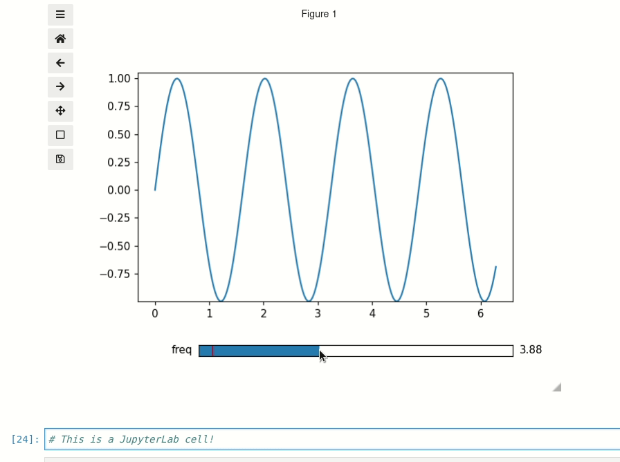

===================
Matplotlib Backends
===================

.. note::
        For discussion of what a Matplotlib backend is see: https://matplotlib.org/faq/usage_faq.html#what-is-a-backend

All of the functions in this library will work with any interactive backend to Matplotlib. However, if you are working in a Jupyter
Notebook then you should make sure to use the `ipympl <https://github.com/matplotlib/ipympl>`_ backend. If you are using a different backend
(such as ``qt5agg``), then the built-in Matplotlib widgets will be used instead of the ipywidgets widgets. It is trickier to achieve a good
layout of Matplotlib widgets versus ipywidgets widgets, so if in a Notebook it is best to use the ipympl backend by including
the `Jupyter Magic <https://ipython.readthedocs.io/en/stable/interactive/magics.html>`_:

.. code-block:: python

        %matplotlib ipympl

Further options
---------------

If you want to use a non-ipympl backend in a Jupyter Notebook but still want ``ipywidgets`` style sliders then you have a few options.

* With ``interactive_plot`` and ``interactive_hist`` you can pass ``force_ipywidgets=True``

.. code-block:: python

    %matplotlib qt
    import numpy as np
    from mpl_interactions import interactive_plot

    x = np.linspace(0,np.pi,100)
    tau = np.linspace(1,10, 100)
    beta = np.linspace(.001,1)
    def f(x, tau, beta):
        return np.sin(x*tau)*x**beta
    fig, ax, sliders = interactive_plot(f, x=x, tau = tau, beta = beta, force_ipywidgets=True)

This will result in sliders in the notebook, but the plot will be in a ``qt`` window:

.. image:: _static/images/force-ipywidgets.png

* You can also explicitly set whether to use Matplotlib sliders or not with the ``use_ipywidgets`` 
argument :meth:`~mpl_interactions.interactive_plot_factory`. If ``None`` then the funciton will try to infer whether
to use ipywidgets or not. By setting the argument to ``False`` then you will be able to use Matplotlib sliders in the notebook.

.. code-block:: python

    %matplotlib ipympl
    import matplotlib.pyplot as plt
    import numpy as np
    from matplotlib.widgets import Slider
    from mpl_interactions import interactive_plot_factory
    fig, ax = plt.subplots()
    plt.subplots_adjust(bottom=.25)
    x = np.linspace(0,2*np.pi,200)
    def f(x, freq):
        return np.sin(x*freq)
    axfreq = plt.axes([0.25, 0.1, 0.65, 0.03])
    slider = Slider(axfreq,label='freq', valmin=.05, valmax = 10)
    controls = interactive_plot_factory(ax,f,x=x,freq=slider,use_ipywidgets=False)

