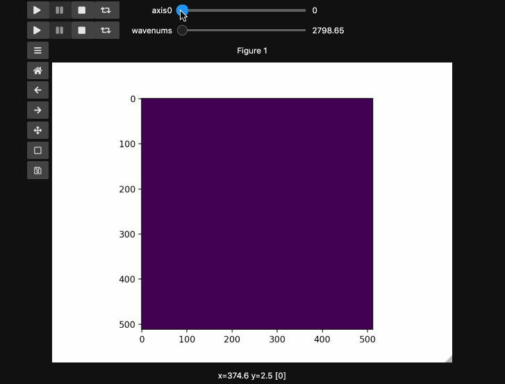

===========
Hyperslicer
===========

The hyperslicer function is meant to make it easier to explore imaging hyperstacks. It was designed with hyperspectral Stimulated Raman Scattering in mind but should be useful for microscopy modalities like fluorescence with xyzt type stacks.

:meth:`hyperslicer` minimally requires an arrary whose last two (or three, if using RGB(A) images) dimensions are the image dimensions and all previous dimensions are taken to represent slices of the hyperstack. It will automatically generate sliders that select the the relevant slice along each dimension of the input array. 

The example here uses a hyperspectral stimulated raman scattering stack of beads that 
are Raman active at different wavenumbers (No need to worry about the specifics but if
you're interested, the experimental setup is very similar to what is described
`here <https://pubs.acs.org/doi/abs/10.1021/jp308938t>`_). You can download the dataset from
`here <https://github.com/jrussell25/data-sharing/raw/master/srs_beads.npy>`_). The image contains two different bead species made of PMMA and polystyrene of different sizes. Some basic information for viewing and understanding the dataset is given in the table below.

+-------------+--------------+------------+-----------------+
| Bead Type   | Approx. Size | Peak Index | Peak Wavenumber |
+=============+==============+============+=================+
| PMMA        | 10 µm        | 66         | 2935 cm^-1      |
+-------------+--------------+------------+-----------------+
| Polystyrene | 5 µm         | 111        | 3033 cm^-1      |
+-------------+--------------+------------+-----------------+

Basic Usage
===========

.. code-block:: python

    import numpy as np
    import matplotlib.pyplot as plt
    import requests
    import io
    from mpl_interactions import hyperslicer
    %matplotlib ipympl

    # Get the dataset directly from github
    response = requests.get('https://github.com/jrussell25/data-sharing/raw/master/srs_beads.npy')
    response.raise_for_status()
    beads = np.load(io.BytesIO(response.content)) 

In the minimal case, you can just pass the data array. You can pass all the familiar arguments to imshow which is unsurprisingly at the heart of hyperslicer. For reasons that will become apparent in the main example, here we specify ``vmin`` and ``vmax`` to keep the full range for 8bit images.

.. code-block:: python

    fig1, ax1 = plt.subplots()
    control1 = hyperslicer(beads, vmin=0, vmax=255)

.. image:: ../_static/hyperslicer1.gif

Now lets form a slightly artificial example which superimposes a linear intensity 
stacle on top of the ``beads`` spectral stack. This will illustrate how ``hyperslicer`` 
generalizes to higher dimensional stacks.

.. code-block:: python

    beads4d = np.linspace(0,1,25)[:,None,None,None]*np.stack([beads for i in range(25)])
    print(beads4d.shape) # (25, 126, 512, 512)
    fig2, ax2 = plt.subplots()
    controls2 = hyperslicer(beads4d, vmin=0, vmax=255)

.. image:: ../_static/hyperslicer2.gif

Names and Values for sliders
============================

You can also provide names and or limits to map the sliders from the integers to other 
numbers. For instance in the ``beads4d`` dataset, we can replace the first dimension 
with the relative intensity of the image in [0,1] and the first dimension with the 
relevant spectrosocpic values, Raman wavenumbers. 

The cells below show the two valid ways to generate these hyperslicers, first by passing
a start, stop tuple and second by passing a full array containing the slider values.
``hyperslicer`` handles mapping these values to indices to slice the data. Either of 
these options can be mixed with ``None`` or simply omitted to generate the default 
integer valued sliders as above. Separately, you can provide names for each axis to 
replace the ``axis0`` style labels used by default.

.. code-block:: python

    wns = np.linspace(2798.6521739130435, 3064.95652173913, beads4d.shape[1])

    fig3, ax3 = plt.subplots()
    controls3 = hyperslicer(beads4d, vmin=0, vmax=255, 
                                       axis0=(0,1), axis1=wns,
                                       names=('linear', 'wavenums')
                                      )

.. image:: ../_static/hyperslicer3.gif 

*Note*: Matplotlib sliders currently do not support displaying different values than 
the slider actually uses internally. Thus for ``hyperslicer`` matplotlib sliders must
be integer valued sliders that display the values of the index of the array.

Instead of specifying the values for each axis and the names separately, one can use the ``axes`` keyword argument which expects a 2-tuple for each axis containing ``(name, (start, stop))`` or ``(name, slider_value_array)``. Using the axes argument is probably the best way to use ``hyperslicer``. The cell below produces an identical result to the previous cell.

.. code-block:: python
    
    fig4, ax4 = plt.subplots()
    controls4 = hyperslicer(
        beads4d, vmin=0, vmax=255, axes=(("linear", (0, 1)), ("wavenums", wns))
    )

Play Buttons
============

For those used to working in ImageJ/FIJI or various propietary microscope softwares,
you might miss the ability to loop through your stacks. With ``hyperslicer`` just pass the argument ``play_buttons=True`` to animate the sliders for each axis or use any of the other argument patterns described `here <https://mpl-interactions.readthedocs.io/en/latest/examples/tidbits/play-button.html>`_.

.. code-block:: python

    fig5, ax5 = plt.subplots()
    controls5 = hyperslicer(
        beads4d,
        vmin=0,
        vmax=255,
        axes=(("linear", (0, 1)), ("wavenums", wns)),
        play_buttons=True,
        play_button_pos="left",
    )
    

Other Valid Call Signatures
===========================

All of the below are valid calls to hyperslicer, which generally supports omitting any of the labels or names while falling back to integer valued sliders. If you come across bugs relating to omitting values or passing ``None`` please feel free to `open an issue <https://github.com/ianhi/mpl-interactions/issues>`_.

.. code-block:: python
    
    fig6, ax6 = plt.subplots()
    controls6 = hyperslicer(beads4d, vmin=0, vmax=255, 
                                       axes=(('linear', (0,1)),'wavenums')
                                      )

    fig7, ax7 = plt.subplots()
    controls7 = hyperslicer(beads4d, vmin=0, vmax=255, 
                                       axes=(('linear', 0,1),'wavenums')
                                      )

    fig8, ax8 = plt.subplots()
    controls8 = hyperslicer(beads4d, vmin=0, vmax=255, 
                                       axes=((0,1),'wavenums')
                                      )
