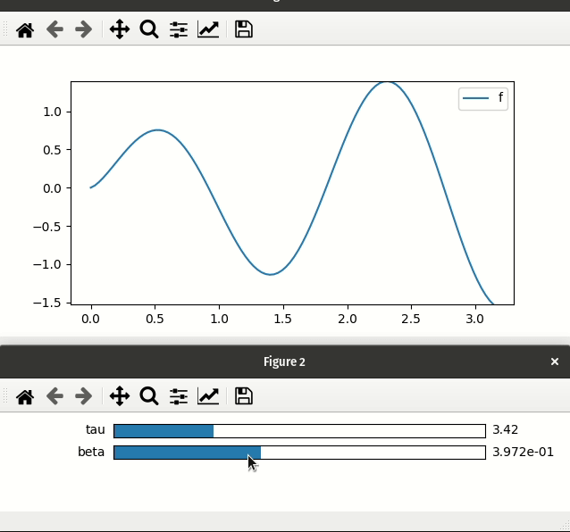
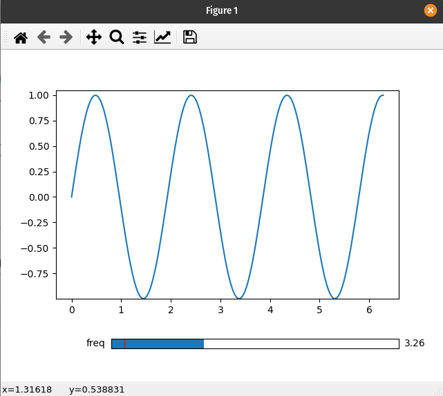

========================
Using Matplotlib Widgets
========================

.. warning::
    When using Matplotlib widgets you need to make sure you always keep a reference to the control sliders, otherwise the callbacks
    will be garbage collected and cease to work.

This page is dedicated to showing how to use the ``interactive_*`` functions---such as ``interactive_plot``---with Matplotlib widgets. For
a more general discussion of how to use the ``pyplot`` submodule see the :doc:`Usage-Guide` page.

Differences from ipywidgets sliders
-----------------------------------
**1.** mpl-sliders are different from ipywidgets sliders in that they will only take a min and and max with
an optional step, while for ipywidgets sliders you need to specify all values (at least until version 8).
A consequence of this is that the various ``interactive_*`` methods will only use the first two values of any tuples
passed as a parameter (i.e. they will ignore the ``num`` argument to linspace).

**2.** Laying out Matplotlib widgets is signifcantly more difficult than laying out elements in a web browser. If you
pass an existing Matplotlib widget a parameter then the plot will update as expected; however, the ``interactive_*``
methods will *not* display it for you. Alternatively, when using ipywidgets widgets, if you give a widget as a parameter
it will be included in the display of the controls created by the function.

Basic example
-------------

If you are not using the ``ipympl`` backend then ``mpl_interactions`` will automatically create a new figure to hold all the controls.

.. code-block:: python

    import matplotlib.pyplot as plt
    import numpy as np
    from mpl_interactions import interactive_plot, interactive_plot_factory

    x = np.linspace(0,np.pi,100)
    tau = np.linspace(1,10, 100)
    beta = np.linspace(.001,1)
    def f(x, tau, beta):
        return np.sin(x*tau)*x**beta
    fig, ax, sliders = interactive_plot(f, x=x, tau = tau, beta = beta, slider_format_string={'beta': '%1.3e'})
    plt.legend()
    plt.show()

Custom positioning of Matplotlib widgets
----------------------------------------

There does not seem to be a consistent and simple way to layout Matplotlib widgets in the same figure as the controlled plot.
To address this, mpl_interactions will open a new figure to place all the controls. 

If you would like the sliders and the plot to live in the same figure, you will need to create your own Slider widget and use 
the :meth:`~mpl_interactions.interactive_plot_factory` function:

.. code-block:: python

    import matplotlib.pyplot as plt
    import numpy as np
    from matplotlib.widgets import Slider
    from mpl_interactions import interactive_plot_factory
    fig, ax = plt.subplots()
    plt.subplots_adjust(bottom=.25)
    x = np.linspace(0,2*np.pi,200)
    def f(x, freq):
        return np.sin(x*freq)
    axfreq = plt.axes([0.25, 0.1, 0.65, 0.03])
    slider = Slider(axfreq,label='freq', valmin=.05, valmax = 10)
    controls = interactive_plot_factory(ax, f, x=x, freq=slider)
    plt.show()

