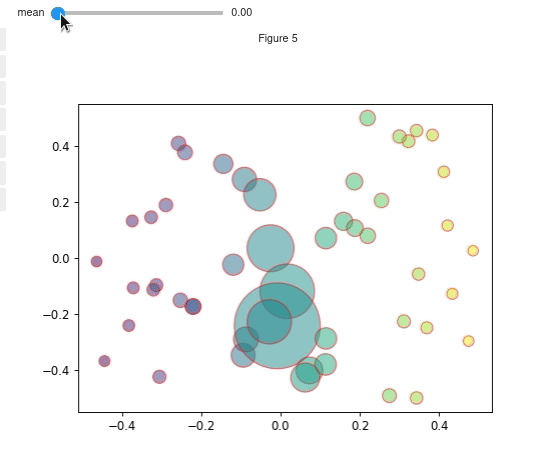
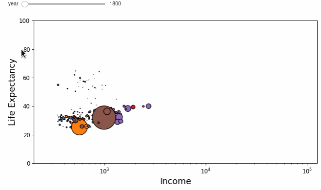

=============
Scatter plots
=============

.. note::
    Unfortunately the interactive plots won't work on a website as there is no Python kernel
    running. So for all the interactive outputs have been replaced by gifs of what you should expect.

On this example page all of the outputs will use ipywidgets widgets for controls. However, if you are
not working in a Jupyter notebook then the examples here will still work with the built-in Matplolitb widgets.
For examples that that explicitly use matplotlib widgets instead of ipywidgets check out the :doc:`mpl-sliders` page.

.. jupyter-execute::

    # only run these lines if you are using a jupyter notebook or jupyter lab
    %matplotlib ipympl
    import ipywidgets as widgets

    # rest of imports
    import matplotlib.pyplot as plt
    import numpy as np
    from mpl_interactions import interactive_scatter

Basic example
-------------

.. code-block:: python

    N = 50
    x = np.random.rand(N)
    def f_y(x, tau):
        return np.sin(x*tau)**2 + np.random.randn(N)*.01
    fig, ax, controls = interactive_scatter(x,f_y, tau = (1, 2*np.pi, 100)) 

.. image:: ../images/scatter1.png

Multiple functions and broadcasting
-----------------------------------

You can also use multiple functions. If there are fewer ``x`` inputs than ``y`` inputs then the ``x`` input will be broadcast
to fit the ``y`` inputs. Similarly ``y`` inputs can be broadcast to fit ``x``. You can also choose colors and sizes for each line
    
.. code-block:: python

    N = 50
    x = np.random.rand(N)
    def f_y1(x, tau):
        return np.sin(x*tau)**2 + np.random.randn(N)*.01
    def f_y2(x, tau):
        return np.cos(x*tau)**2 + np.random.randn(N)*.1
    fig, ax, controls = interactive_scatter(x, [f_y1, f_y2],
                                            tau = (1, 2*np.pi, 100),
                                            c = ['blue', 'red'])  

.. image:: ../images/scatter2.png

Functions for both x and y
--------------------------

The function for ``y`` should accept ``x`` and then any parameters that you
will be varying. The function for ``x`` should accept only the parameters.

.. code-block:: python

    N = 50
    def f_x(mean):
        return np.random.rand(N) + mean
    def f_y(x, mean):
        return np.random.rand(N) - mean
    fig, ax, controls = interactive_scatter(f_x, f_y,
                                            mean = (0, 1, 100),
                                            s = None,
                                            c = np.random.randn(N))

.. image:: ../images/scatter3.png

Using functions for other attributes
------------------------------------

You can also use functions to dynamically update other scatter attributes such as the ``size``, ``color``, ``edgecolor``, and ``alpha``.

The function for ``alpha`` needs to accept the parameters but not the xy positions as it affects every point.
The functions for ``size``, ``color`` and ``edgecolor`` all should accept ``x, y, <rest of parameters>``

.. code-block:: python

    N = 50
    mean =  0
    x = np.random.rand(N) + mean - .5
    def f(x, mean):
        return np.random.rand(N) + mean - .5
    def c_func(x,y, mean):
        return x
    def s_func(x,y, mean):
        return np.abs(40/(x+.001))
    def ec_func(x,y,mean):
        if np.random.rand() >.5:
            return 'black'
        else:
            return 'red'
    fig, ax, sliders = interactive_scatter(x, f, mean = (0, 1, 100),
                                        c= c_func,
                                        s=s_func,
                                        edgecolors=ec_func,
                                        alpha=.5,
                                        )

Modifying the colors of individual points
-----------------------------------------

.. code-block:: python

    N = 500
    x = np.random.rand(N) - .5
    y = np.random.rand(N) - .5
    def f(mean):
        x = (np.random.rand(N)-.5) + mean
        y = 10*(np.random.rand(N)-.5) + mean
        return x, y  
    def threshold(x,y,mean):
        colors = np.zeros((len(x), 4))
        colors[:,-1] = 1
        deltas = np.abs(y - mean)
        idx = deltas < .01
        deltas /= deltas.max()
        colors[~idx, -1] = np.clip(.8-deltas[~idx],0,1)
        return colors

    fig, ax, sliders = interactive_scatter(x, y, mean = (0, 1, 100), alpha = None, c= threshold)

.. image:: ../images/scatter5.png

Putting it together - Wealth of Nations
---------------------------------------
Using interactive_scatter we can recreate the interactive
`wealth of nations <https://observablehq.com/@mbostock/the-wealth-health-of-nations>`_ plot using Matplotlib!

The data preprocessing was taken from an
`example notebook <https://github.com/bqplot/bqplot/blob/55152feb645b523faccb97ea4083ca505f26f6a2/examples/Applications/Wealth%20Of%20Nations/Bubble%20Chart.ipynb>`_
for the `bqplot <https://github.com/bqplot/bqplot>`_ library. If you are working in jupyter notebooks then you should definitely check out bqplot!

.. code-block:: python

    # this preprocessing was taken wholesale from the bqplot example 
    # bqplot is under the apache license, see their license file here:
    # https://github.com/bqplot/bqplot/blob/55152feb645b523faccb97ea4083ca505f26f6a2/LICENSE
    data = pd.read_json('nations.json')
    def clean_data(data):
        for column in ['income', 'lifeExpectancy', 'population']:
            data = data.drop(data[data[column].apply(len) <= 4].index)
        return data

    def extrap_interp(data):
        data = np.array(data)
        x_range = np.arange(1800, 2009, 1.)
        y_range = np.interp(x_range, data[:, 0], data[:, 1])
        return y_range

    def extrap_data(data):
        for column in ['income', 'lifeExpectancy', 'population']:
            data[column] = data[column].apply(extrap_interp)
        return data
    data = clean_data(data)
    data = extrap_data(data)
    income_min, income_max = np.min(data['income'].apply(np.min)), np.max(data['income'].apply(np.max))
    life_exp_min, life_exp_max = np.min(data['lifeExpectancy'].apply(np.min)), np.max(data['lifeExpectancy'].apply(np.max))
    pop_min, pop_max = np.min(data['population'].apply(np.min)), np.max(data['population'].apply(np.max))

.. code-block:: python

    def x(year):
        return data['income'].apply(lambda x: x[year-1800])

    def y(x,year):
        return data['lifeExpectancy'].apply(lambda x: x[year-1800])

    def s(x, y, year):
        pop =  data['population'].apply(lambda x: x[year-1800])
        return 4000*pop.values/pop_max
    regions = data['region'].unique().tolist()
    c =  data['region'].apply(lambda x: list(TABLEAU_COLORS)[regions.index(x)]).values

.. code-block:: python

    fig, ax, controls = interactive_scatter(x, y, s=s, year = np.arange(1800,2009),c=[c],
                                            edgecolors='k',
                                            slider_format_string='{:d}',
                                            figsize=(10,4.8))
    fs = 15
    ax.set_xscale('log')
    ax.set_ylim([0,100])
    ax.set_xlim([200,income_max*1.05])
    ax.set_xlabel('Income', fontsize=fs)
    _ = ax.set_ylabel('Life Expectancy', fontsize=fs)

