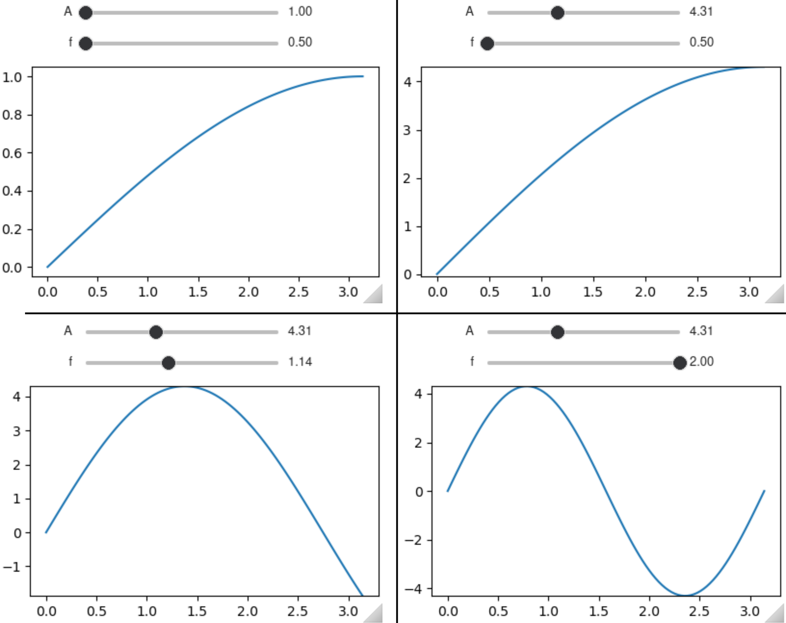
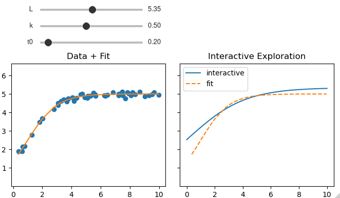

# Summary

<!-- A summary describing the high-level functionality and purpose of the software for a diverse, non-specialist audience. -->

Data exploration, model building and pedagogy all benefit from the ability to interactively update elements in Matplotlib [@Hunter:2007] figures. `mpl-interactions` enables this by making it easy for users to create Matplotlib figures in which the displayed data can be dynamically controlled through widgets. These widgets can be automatically generated by passing arguments such as arrays or shorthands (such as a tuple of numbers to generate a slider) to modified pyplot functions. After creation of these widgets, `mpl-interactions` updates plot elements without further user intervention. For ease of use, it adds these features while otherwise staying close to the `matplotlib.pyplot` interface. `mpl-interactions` is built such that parameters controlled by the generated widgets are easy to re-use for multiple plot elements, while not interfering with static elements. This design allows for building any figure that `Matplotlib` can produce, while adding interactivity to specific parts as desired.

Complete tutorials, examples, and API documentation are available on https://mpl-interactions.readthedocs.io/en/stable/.

# Statement of Need

<!-- A Statement of need section that clearly illustrates the research purpose of the software and places it in the context of related work. -->

The ability to interact dynamically with plots through widgets such as sliders can be a powerful tool in the scientific process and in pedagogy. For instance, varying a parameter of a mathematical model plotted on top of data helps to understand the relationship between the model and the data. Similarly, exploratory data analysis can be enhanced by interactively modifying aspects of the plot such as which points are displayed, or the threshold level of a displayed image. `mpl-interactions`' core goal is to make this aspect of interactive plotting easier when using Matplotlib. Other interactive functionalities are out of scope as they are provided by Matplotlib (e.g. zooming and panning), or by other third party packages (e.g. point selection).

Matplotlib provides mechanisms for updating elements (artists) in figures. However, the APIs for these artists are not consistent and some are under- or undocumented. Furthermore, the creation and positioning of the native Matplotlib widgets is nontrivial. While the `ipywidgets` [@interactive_Jupyter_widgets:2015] library makes widget creation and positioning easier, it is difficult to integrate with Matplotlib in a performant manner. The easiest way to do so is to use the `ipywidgets`' `interact()` function, which automatically generates sliders and other widgets to control arguments to arbitrary python functions. However, this can result in completely regenerating the figure which can be slow. Alternatively, the user needs to remember the specifics of how to update each individual artist. While `Matplotlib` and `ipywidgets` provide the tools for controlling plots with widgets, the overhead of implementing such control can overwhelm its utility. `mpl-interactions` fills this gap by making it easy for users to generate widgets that dynamically control plots.

There are a wide range of data visualization tools for Python, such as Altair [@VanderPlas2018], Holoviz[@philipp_rudiger_2020_3634720], and Plotly[@plotly], which provide rich interactive plotting experiences. These tools often have overlaping functionality with `mpl-interactions` and in some cases provide a greater range of interactive capabilities. However, they may not be useful for a user already invested in using Matplotlib, or for a user for whom Matplotlib is otherwise the best solution. For such users `mpl-interactions` adds functionality to `Matplotlib`. To this end `mpl-interactions` closely follows the semantics of the Matplotlib API, rather than creating a separate set of semantics, like the other mentioned libraries. Thus it enhances an analysis workflow that uses Matplotlib by enabling users to add interactive features to a library they are already using, rather than using different libraries for different aspects of the data analysis process.

# Overview

`mpl-interactions` provides several key features to make generating interactive figures simple. The first is what arguments are accepted. While `Matplotlib` requires users to pass arrays as arguments, `mpl-interactions` allows passing a function that returns numeric values. Parameters to these functions are specified by adding extra keyword arguments (`kwargs`) to the plotting function call. Then `mpl-interactions` will generate the appropriate widgets for the parameters and run the functions to generate the numerical data to plot. For example, to plot a sinusoid and control its amplitude and frequency using sliders, a function returning the `y` values is defined and passed as the `y` parameter to the `plot` function. The ranges of the `A` and `f` parameters are defined as extra keyword arguments using tuples as a shorthand for what widget to generate.

```python
import mpl_interactions.ipyplot as iplt
import matplotlib.pyplot as plt
import numpy as np

fig, ax = plt.subplots()

def sinusoid(x, A, f):
    return A*np.sin(x * f)

x = np.linspace(0, np.pi, 100)

ctrls = iplt.plot(x, sinusoid, A=(1, 10), f = (.5, 2))
plt.show()
```



A second important feature of `mpl-interactions` is that interactive plot components are not isolated from each other. That is, the control widgets generated from one plotting call can be re-used to control other components. In addition to showing the re-use of control widgets this example demonstrates how Matplotlib styling arguments (such as `vmin`) can be controlled through widgets.

```python
N = 128
rng = np.random.default_rng(seed=1995)
im = rng.normal(size=(N,N))

fig, axs = plt.subplots(1, 2, figsize=(12, 5))


# create interactive controls
ctrls = iplt.imshow(im, vmin_vmax=("r", im.min(), im.max()), ax=axs[0])

# plot histogram of pixel intensities

# by indexing the ctrls object it is possible to
# re-use the the vmin and vmax created by imshow
# to control the position of the axvlines
iplt.axvline(ctrls["vmin"], ax=axs[1], c="k")
iplt.axvline(ctrls["vmax"], ax=axs[1], c="k");
axs[1].hist(im.flatten(), bins="auto")
axs[1].set_title("Histogram of Pixel Intensities")
axs[1].set_xlabel('Pixel Intensity')
```


Finally, `mpl-interactions` allows the reuse of Python functions performing mathematical operations in multiple parts of user code, rather than requiring users to write a plotting specific version. For example, below the `logistic_growth` function is used for both curve fitting and an interactive display in order to better understand the role of the model parameters.

```python
%matplotlib ipympl
import matplotlib.pyplot as plt
import numpy as np
from scipy.optimize import curve_fit

import mpl_interactions.ipyplot as iplt


def logistic_growth(t, L, k, t0):
    return L / (1 + np.exp(-k * (t - t0)))


# create a synthetic dataset of logistic growth
rng = np.random.default_rng(seed=1995)
t_data = np.sort(rng.uniform(0, 10, size=50))
y_data = logistic_growth(
  t_data, L=5, k=1, t0=1) + rng.normal(size=t_data.size, scale=0.1
)


# You can use the `logistic_growth` function to curve_fit
popt, pcov = curve_fit(logistic_growth, t_data, y_data)


# Now you can directly the same function to make
# an interactive plot to better understand its parameters
fig, axs = plt.subplots(1, 2, sharey=True)
axs[0].plot(t_data, y_data, "o")
axs[0].plot(t_data, logistic_growth(t_data, *popt))
axs[0].set_title("Data + Fit")
axs[1].set_title("Interactive Exploration")

ctrls = iplt.plot(
    np.linspace(0, 10),
    logistic_growth,
    L=(0.5, 10),
    k=(0.1, 1),
    t0=(0, 2.5),
    ax=axs[1],
    label="interactive",
)
axs[1].plot(t_data, logistic_growth(t_data, *popt), "--", label="fit")
plt.legend()
```

{ width=75% }

This framework makes it easy to generate complex interactive visualizations. It also enables `mpl-interactions` to manage generating GIFs. Any parameter controlled through `mpl-interactions` can be used to automatically generate a gif of the plot changing as a function of that parameter ([Animation Documentation](https://mpl-interactions.readthedocs.io/en/stable/examples/animations.html)). Thus `mpl-interactions` can assist across the data visualization process, from initial exploration to the creation of a final animated plot as a GIF.

# Acknowledgements

This work was supported by a National Defense Science and Engineering Graduate Fellowship (FA9550-19-F-0008, to IHI), the George W. Merck Fund of the New York Community Trust (award 338034, to DRH), and funds from Harvard University.

We thank Dr. K. Dalton from stimulating discussion, and Easun Arunachalam for feedback on drafts of this paper. In addition, many users have contributed features and bug fixes. Of particular note are Remco de Boer, and Samantha Hamilton who made contributions to documentation and code, and documentation respectively. A full list of coding contributors can be found here: https://github.com/mpl-extensions/mpl-interactions/graphs/contributors

Finally, many users have contributed in ways other than coding. For example by raising issues either with the package or documentation. These users are recognized here: https://github.com/mpl-extensions/mpl-interactions#contributors-

# References
