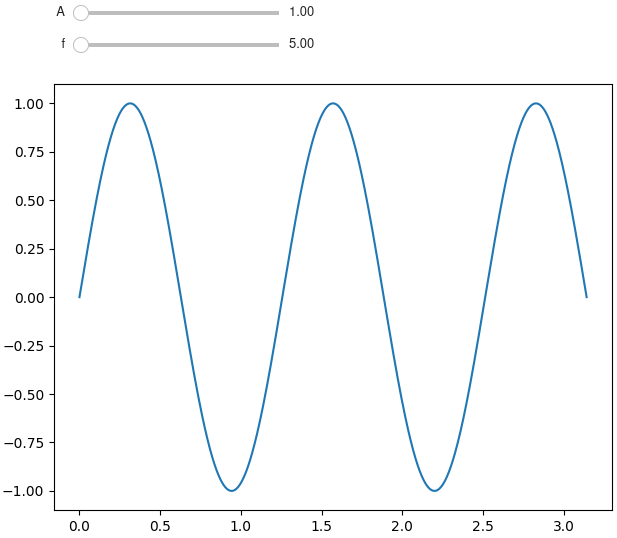

# Summary

<!-- A summary describing the high-level functionality and purpose of the software for a diverse, non-specialist audience. -->

`mpl-interactions` enables users to transform static matplotlib figures to dynamic figures with control of the parameters of the plot elements through automatically generated widgets. It creates widgets and connects them to update plot elements automatically using a shorthand for widgets optimized for control of plots. In order to be as easy to use as possible it adds these features while otherwise staying as close to the `matplotlib.pyplot` interface as possible. It is built to be composable with itself while not interfering with static plotting elements. This allows for building any figure that `matplotlib` can produce while adding dynamism to specific parts as necessary to increase the utility of the plot. `mpl-interactions` allows to be used for exploring the parameters of computational and mathematical models.

# Statement of Need

<!-- A Statement of need section that clearly illustrates the research purpose of the software and places it in the context of related work. -->

A plot that dynamically updates as a user interacts with a widget such as a slider can be a very powerful tool in the scientific process as well as in pedagogy. For instance varying a parameter of a mathematical model plotted on top of data helps to understand the model - useful for both modelling in research and for pedagogy. Similarly it very useful during exploratory data analysis to interactively modify aspects of the plot such as points are displayed, or the threshold level of image.

While it is possible to accomplish this using existing tools such as `matplotlib` and `ipywidgets`, the complexity of doing so dramatically slows down analysis and learning. `matplotlib` is a powerful Python library for visualizations. For static plots it is the defacto standard for academic work and many students and scientists have familirity produce data visualizations with it. In addition to the capability of creating static figures it has mechanisms for building interactive visualizations. Many of it's artists have APIs that allow updating them to reflect new data and it implements a basic set of widgets such as sliders and radio buttons. However, artist APIs are not consistent and sometimes under or undocumented, and positioning the widgets can be non-trivial. Learning, and then remembering the specifics of how to update an artist along with writing the boilerplate of callbacks significantly slows iteration when investigating data.

The `ipywidgets` makes widget creation easier, and handles layout for the user, but is still difficult to use quickly with matplotlib as doing so requires remembering how update matplotlib artists and writing approriate callbacks. The easiest approach for users is to use hte `ipywidgets`' `interact` function (footnote: this is inspiration for the package name) which automatically generates sliders and other widgets to control arguments to arbitrary python functions. However, the this has drawbacks as well, the recommended usage is to re-make the plot every time a parameter changes, and it only works in an context where ipywidgets can be displayed (e.g. jupyterlab). Finally, `ipywidgets` is a general framework, and thus constrained in how it's choices of how to intrepret shorthands for widget generation - the choices it makes are not always optimal for scientific plotting.

`mpl-interactions` builds on top of both of these packages in order make their power available while reducing the complexity of generating an interactive plot to a single line. It automates the creation of widgets, using a shorthand optimized for scientific plotting. It works anywhere matplotlib does, creating ipywidgets if they are available, but falling back to matplotlib widgets necessary. In addition when generating matplotlib widgets it automatically handles widget layout. After creating widgets it connects callbacks to update the matplotlib artists in the most performant way possible. Finally, `mpl-interactions` handles, updating the matplotlib axis limits as the plot elements update. Without this plot elements can easily go off screen.

# Examples

Imports for examples:

```python
import mpl_interactions.ipyplot as iplt
import matplotlib.pyplot as plt
import numpy as np
```

Example demonstrating the ability to update the axis limits, as well passing a numpy array, or a tuple to generate a slider:

```python
x = np.linspace(0, np.pi, 100)
tau = np.linspace(0.5, 10, 100)

def f1(x, tau, beta):
   return np.sin(x * tau) * x * beta

fig, ax = plt.subplots()
controls = iplt.plot(x, f1, tau=tau, beta=(1, 10, 100))
plt.show()
```

And example demonstrating reusing widgets generated from earlier function calls to control other plot elements.

```python
N = 128
im = np.random.randn(N * N).reshape(N, N)

fig, axs = plt.subplots(1, 2, figsize=(12, 5))

# plot histogram of pixel intensities
axs[1].hist(im.flatten(), bins="auto")
axs[1].set_title("Histogram of Pixel Intensities")

# create interactive controls
ctrls = iplt.imshow(im, vmin_vmax=("r", im.min(), im.max()), ax=axs[0])
iplt.axvline(ctrls["vmin"], ax=axs[1], c="k")
_ = iplt.axvline(ctrls["vmax"], ax=axs[1], c="k")
```

# Overview

`mpl-interactions` builds on top of the `matplotlib.pyplot`. While `matplotlib` requires users are to pass in arrays as arguments, `mpl-interactions` allows passing a function that returns numeric values. Parameters to these functions are specified by adding extra keyword arguments (`kwargs`) to the function call. Then `mpl-interactions` will generate the approriate widgets for the parameters and run the functions to generate the numerical data to plot. For example to plot a sinusoid and control it's amplitude and frequency using sliders a function returning the `y` values is defined and passed as the `y` parameter to the `plot` function. The ranges of the `A` and `f` parameters are defined using as extra kwargs using tuples as a widget shorthand.

```python
import mpl_interactions.ipyplot as iplt
import matplotlib.pyplot as plt
import numpy as np

fig, ax = plt.subplots()

def sinusoid(x, A, f):
   return A*np.sin(x * f)
x = np.linspace(0, np.pi, 100)

ctrls = iplt.plot(x, sinusoid, A=(1, 10), f = (.5, 2))
plt.show()
```

{ width=75% }

# Acknowledgements

Ian was supported by the NDSEG + Doeke

Discussion: Kevin Dalton
Contributions: John Russell, Remco De Boer, Samantha Hamilton,

- other contributors.

Many users who have posted questions + feedback
